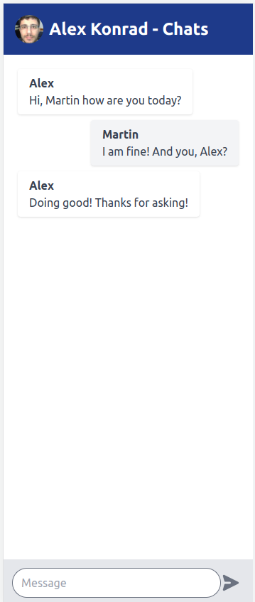
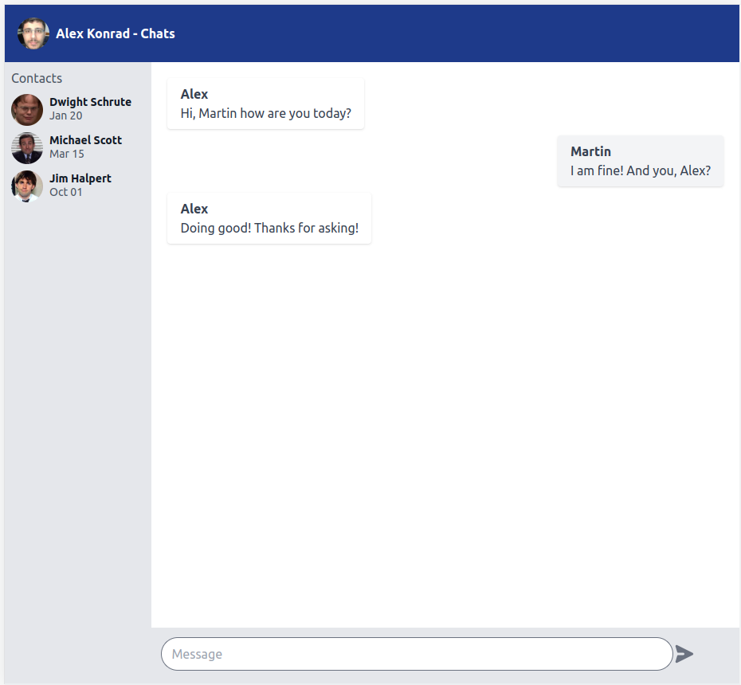

# Chat: Also For Sale (TEST)

Runy on Rails Responsive Chat Layout Application (Mobile First) that respond to different screen sizes, using Tailwind CSS Framework and Slim Templates.




Requirements
------------
This app requires the following to run:
  * Ruby 3.1.*
  * Bundle 2.3.*

Technologies
------------
This app uses the follow technologies:
  * Ruby On Rails 7.0.3
  * Tailwind CSS 3.1.18
  * Rails View Component 2.69.0
  * Slim Template for Rails
   
## Installation
This App was written on Rails 7,so it use the basic rails workflow, after clone this repo you need to follow the instructions bellow.

```bash
cd also-for-sale
bundle install
```
## Usage
```bash
rails c
```
## License
[MIT](https://choosealicense.com/licenses/mit/)